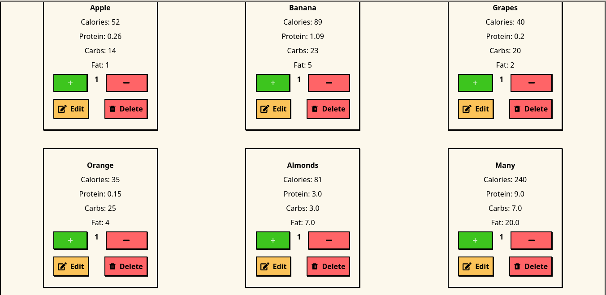

# React + Vite

This is a simple project that simulates a meter to measure the nutrients in the food consumed daily, has a form to enter the food with a maximum limit of 6 items to add and display the calculation of the results of the calorie diet, you can clone this project and download it to a local folder and implement it.

&nbsp;  &nbsp;  &nbsp; 

